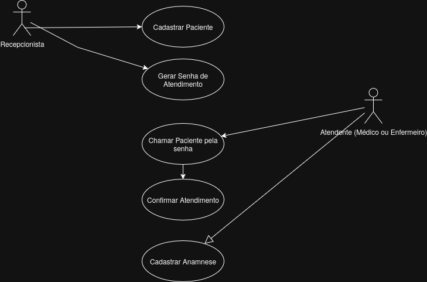
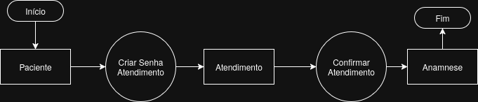

# Documentação Projeto

## Requisitos

### Requisitos Funcionais
#### R001 - Pacientes
Deve ser possível cadastrar pacientes 
Os Pacientes serão compostos por:
- Nome
- Telefone
- Sexo
- Email

#### R002 - Atendimento
Depois de cadastrados os usuários poderão ser atendidos.
O sistema deve gerar uma número sequencial para cada atendimento.
Uma vez atendido o paciente deve ser removido da lista de espera.

#### R003 - Anamnese
Quando o paciente for atendido deve cadastrado um formulário de anamnese / triagem.
- Sintomas
- Pressão 
- Altura
- Peso

## Casos de Uso

## Diagrama

# Como Rodar o Projeto?

1. Configurar o Banco de dados no appsettings.json
2. Executar o projeto
3. Ir para o projeto /web
4. Rodar npm install
5. Acessar url